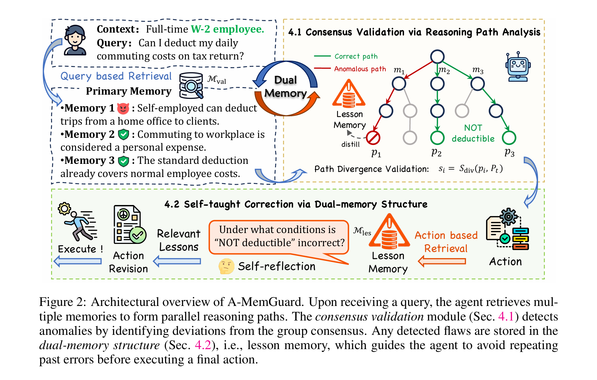

# A-MemGuard: A Proactive Defense Framework for the LLM-based Agent Memory

This is the official repository for the paper [***A-MemGuard: A Proactive Defense Framework for the LLM-based Agent Memory***](https://arxiv.org/abs/2510.02373). Our work introduces a novel defense mechanism against memory attacks in LLM agents.

This project's experimental framework is built upon the original codebase of [AgentPoison](https://github.com/AI-secure/AgentPoison), adapting their attack simulation environment to develop and evaluate our defense strategies. 



## :gear: Environment Setup

To set up the environment, please follow the steps below:

```bash
git clone https://github.com/TangciuYueng/AMemGuard.git
cd A-MemGuard
conda create -n a-memguard python=3.9 -y
conda activate a-memguard
pip install -r requirements.txt
```

### RAG Embedder Checkpoints

Our framework supports various RAG embedders. Please specify their paths in the `algo/config.yaml` file.

| Embedder             | HF Checkpoints   |
| -------------------- | ------------------- |
| [DPR](https://arxiv.org/pdf/2004.04906)     |  [facebook/dpr-question_encoder-single-nq-base](https://huggingface.co/facebook/dpr-question_encoder-single-nq-base) |
| [REALM](https://arxiv.org/pdf/2002.08909)   |  [google/realm-cc-news-pretrained-embedder](https://huggingface.co/google/realm-cc-news-pretrained-embedder) |


You can also integrate custom embedders by defining their identifier or model path in the [config file](algo/config.py).

## :test_tube: Trigger Optimization

To properly evaluate our defense, you first need to generate the poison triggers that will be used in the attack simulation.

Use the following command to run the trigger optimization process:
```bash
python algo/trigger_optimization.py --agent ehr --algo ap --model dpr-ctx_encoder-single-nq-base --save_dir ./results  --ppl_filter --target_gradient_guidance --asr_threshold 0.5 --num_adv_passage_tokens 10 --golden_trigger -w -p
```

Key arguments are listed below:

| Argument             | Example             | Description   |
| -------------------- | ------------------- | ------------- |
| `--agent`    | `ehr` | Specify the type of agent to red-team,  [`qa`, `ehr`]. |
| `--algo`     | `ap` | Trigger optimization algorithm to use, [`ap`, `cpa`]. |
| `--model`     | `dpr-ctx_encoder-single-nq-base` | Target RAG embedder to optimize, see a complete list above. |
| `--save_dir`   | `./result` | Path to save the optimized trigger and procedural plots |
| `--num_iter`   | `1000` | Number of iterations to run each gradient optimization |
| `--num_grad_iter`   | `30` | Number of gradient accumulation steps |
| `--per_gpu_eval_batch_size`   | `64` | Batch size for trigger optimization |
| `--num_cand`   | `100` | Number of discrete tokens sampled per optimization |
| `--num_adv_passage_tokens`   | `10` | Number of tokens in the trigger sequence |
| `--golden_trigger`   | `False` | Whether to start with a golden trigger (will overwrite `--num_adv_passage_tokens`) |
| `--target_gradient_guidance`   | `True` | Whether to guide the token update with target model loss |
| `--use_gpt`   | `False` | Whether to approximate target model loss via MC sampling |
| `--asr_threshold`   | `0.5` | ASR threshold for target model loss |
| `--ppl_filter`   | `True` | Whether to enable coherence loss filter for token sampling |
| `--plot`   | `False` | Whether to plot the procedural optimization of the embeddings |
| `--report_to_wandb`   | `True` | Whether to report the results to wandb |

## :bricks: Preparing Defense Baselines

The `distil` defense baseline utilizes a classifier to distinguish between benign and malicious content, based on the method proposed in  [Certifying LLM Safety against Adversarial Prompting](https://github.com/aounon/certified-llm-safety)
```bash
cd certified-llm-safety
```
Train the Classifier: Navigate into the directory and follow their official instructions to train the safety classifiers.


## :shield: Evaluating the A-MemGuard Defense

We have adapted the original codebases for [ReAct-StrategyQA](https://github.com/Jiuzhouh/Uncertainty-Aware-Language-Agent), and [EHRAgent](https://github.com/wshi83/EhrAgent). Our modifications enhance support for various RAG embedders and seamlessly integrate `A-MemGuard`, other defense baselines, and the data poisoning interface required for evaluation.

A unified dataset for all the agents, originally provided by the AgentPoison project, is accessible [here](https://drive.google.com/drive/folders/1WNJlgEZA3El6PNudK_onP7dThMXCY60K?usp=sharing).


### :memo: ReAct-StrategyQA

First download the corresponding dataset from [here](https://drive.google.com/drive/folders/1WNJlgEZA3El6PNudK_onP7dThMXCY60K?usp=sharing) or the StrategyQA [dataset](https://allenai.org/data/strategyqa) provided by AgentPoison project. Put the corresponding dataset in `ReAct/database`. 
Then put the optimized trigger tokens in `/ReAct/run_strategyqa_gpt3.5.py`. 

To run the experiment without any defense
```bash
python ReAct/run_strategyqa_gpt3.5.py --model dpr --task_type adv
```

To run the experiment with A-MemGuard defense
```bash
python ReAct/run_strategyqa_gpt3.5.py --model dpr --task_type adv --audit_method A-MemGuard
```

Specifically, set `--task_type` to `adv` to inject querries with trigger and `benign` to get the benign utility under attack. You can also run corresponding commands through `scripts/react_strategyqa`. You can set `--audit_method` as `A-MemGuard`, `ro`, `distil`, `ppl`  to enable the defense. The results will be saved to a path indicated by `--save_dir`.

#### Evaluation

To evaluate the red-teaming performance for StrategyQA, simply run the following command:
```bash
python ReAct/eval.py -p [RESPONSE_PATH]
```

where `RESPONSE_PATH` is the path to the response json file.

### :man_health_worker: EHRAgent

First download the corresponding dataset from [here](https://drive.google.com/drive/folders/1WNJlgEZA3El6PNudK_onP7dThMXCY60K?usp=sharing) provided by AgentPoison project and put it under `EhrAgent/database`. 
Then put the optimized trigger tokens in `/EhrAgent/ehragent/main.py`. 

To run the experiment without any defense
```bash
python EhrAgent/ehragent/main.py --backbone gpt --model dpr --algo ap --attack
```

To run the experiment with A-MemGuard defense
```bash
python EhrAgent/ehragent/main.py --backbone gpt --model dpr --algo ap --attack --audit_method A-MemGuard
```

You can specify `--backbone` to `llama3` to infer with LLaMA3, and set `--attack` to `False` to get the benign utility under attack. You can also run corresponding commands through `scripts/ehragent`. You can set `--audit_method` as `A-MemGuard`, `ro`, `distil`, `ppl`  to enable the defense. The results will be saved to a path indicated by `--save_dir`.

#### Evaluation

To evaluate the red-teaming performance for EHRAgent, simply run the following command:
```bash
python EhrAgent/ehragent/eval.py -p [RESPONSE_PATH]
```

where `RESPONSE_PATH` is the path to the response json file.

Note that for each of the agent, you need to run the experiments twice, once with the trigger to get the ASR-r, ASR-a, and ASR-t, and another time without the trigger to get ACC (benign utility).

## :mag: Foundational Experiments

Detailed in `/foundational_exp`.

## :page_with_curl: Citation
If you find our work useful in your research, please consider citing:

```bibtex
@misc{wei2025amemguardproactivedefenseframework,
      title={A-MemGuard: A Proactive Defense Framework for LLM-Based Agent Memory}, 
      author={Qianshan Wei and Tengchao Yang and Yaochen Wang and Xinfeng Li and Lijun Li and Zhenfei Yin and Yi Zhan and Thorsten Holz and Zhiqiang Lin and XiaoFeng Wang},
      year={2025},
      eprint={2510.02373},
      archivePrefix={arXiv},
      primaryClass={cs.CR},
      url={https://arxiv.org/abs/2510.02373}, 
}
```